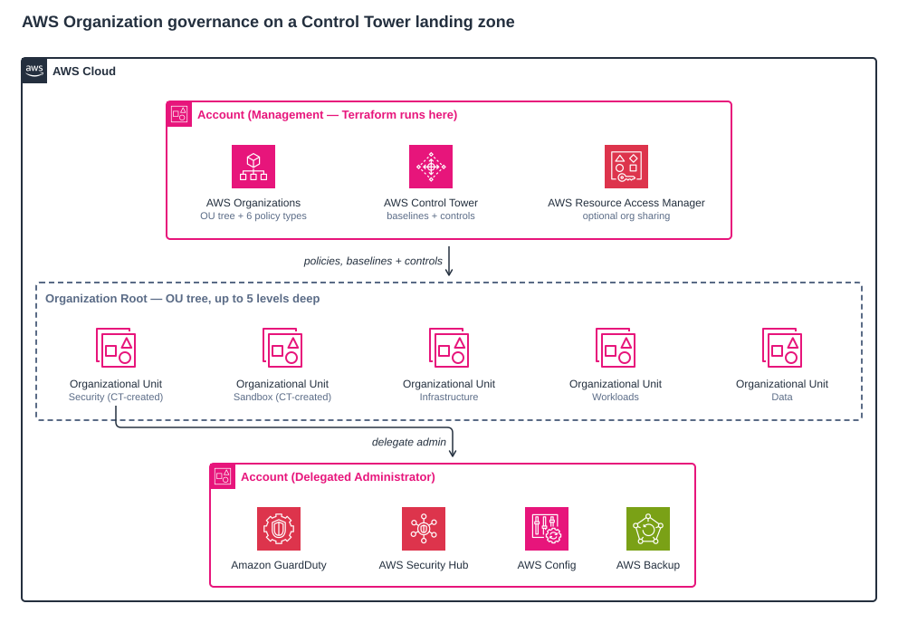
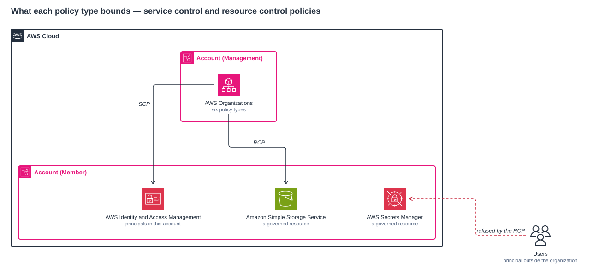
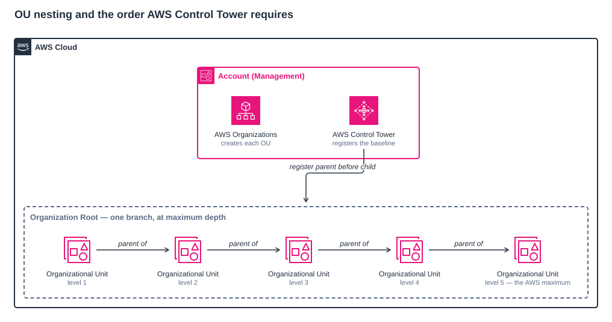
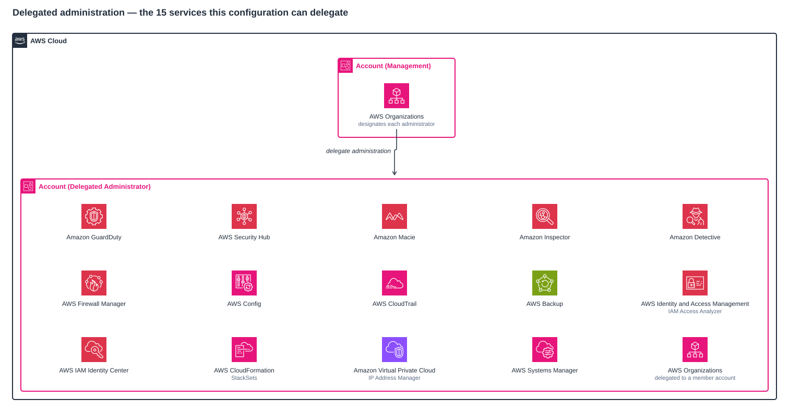

# sample-aws-terraform-org-governance

Terraform sample code for managing AWS Organization governance on top of an existing Control Tower Landing Zone. Covers OU hierarchies, all six AWS Organizations policy types (SCP, RCP, Tag, Backup, AI opt-out, Chatbot), Control Tower baselines and controls, and delegated administrator configuration for 15 AWS services.

## Disclaimer

This is sample code, for non-production usage. You should work with your security and legal teams to meet your organizational security, regulatory and compliance requirements before deployment.

The policies in this repository take effect immediately on attachment and apply to every account in the target OU and below. Attach a new deny policy to a non-production OU and confirm its effect before attaching it to an OU that holds production accounts, and read every `terraform plan` before applying it.

## Architecture

Four figures, each carrying something the others cannot:

| Figure | Answers |
| ------ | ------- |
| [Governance topology](#governance-topology) | What is deployed, and where each kind of governance lands |
| [What each policy type bounds](#what-each-policy-type-bounds) | Why more than one policy type is needed |
| [OU nesting and ordering](#ou-nesting-and-ordering) | How deep the hierarchy goes, and the one order AWS imposes |
| [Delegated administration](#delegated-administration) | Every service whose administration can be delegated |

### Governance topology



This is a **root Terraform deployment**, not a module. It consumes no external modules, holds no provider aliases, and runs in exactly one place: the **organization's management account**, in the Control Tower home region. From there it writes three independent kinds of governance onto the OU tree — Organizations policies, Control Tower baselines and controls, and delegated administration.

Four things worth naming explicitly:

1. **Nothing is created in a member account.** Delegated administration designates an account; it does not deploy into it. The single exception is `aws_macie2_account`, which enables Macie in the _management_ account because AWS requires that before a Macie delegated administrator can be designated.
2. **Policies attach, they do not nest.** A policy document is created once and attached to as many targets as you list. Inheritance down the OU tree is an Organizations behaviour, not something this configuration models.
3. **Controls target OUs, never the root.** Control Tower controls resolve to an OU ARN, so `"root"` is not an addressable target for them the way it is for policies.
4. **RAM sharing is a single organization-wide toggle** with no OU dimension at all.

The delegated administrator is drawn as a separate account because that is what it is. Conventionally it sits inside the `Security` OU — Control Tower places the Audit account there — but the configuration only takes an account ID and does not constrain where that account lives. The figure shows four of the 15 supported services; [Delegated administration](#delegated-administration) has the complete list.

### Ownership boundary

This assumes Control Tower already exists, and deliberately stops at that boundary:

| This configuration owns                                        | Control Tower owns                                                  |
| -------------------------------------------------------------- | ------------------------------------------------------------------- |
| OUs you declare in `var.organization`, up to five levels deep   | The `Security` and `Sandbox` OUs, and the Audit and Log Archive accounts |
| All six AWS Organizations policy types, and their attachments   | The landing zone itself, and its own mandatory guardrails            |
| Which Control Tower baseline version each OU is registered at   | The baseline's contents                                              |
| Which controls are enabled on which OU                         | The control catalog                                                  |
| Delegated administrator designation for 15 services            | —                                                                    |

Declaring a Control Tower OU in `var.organization` would make Terraform try to create it and fail. Targeting one from a policy or a control is supported and expected — see [Addressing targets](#addressing-targets).

### What each policy type bounds



This is why the configuration manages more than one policy type. A **service control policy** bounds what principals *inside* a member account may do — it is the familiar guardrail, and it has no effect on a caller outside the organization. A **resource control policy** bounds what may be done *to* the account's resources, so it reaches a principal an SCP cannot see at all. The remaining four types govern different dimensions again: tag policies enforce tag key casing and allowed values, backup policies apply AWS Backup plans, AI services opt-out policies keep your content out of AI/ML service improvement, and chat applications policies restrict which Slack workspaces and Microsoft Teams channels can reach your accounts.

### OU nesting and ordering



The governance topology figure shows the OU tree as a flat row of siblings, which cannot show depth. AWS permits five levels beneath the root and the configuration implements exactly that. The figure also shows the one ordering AWS imposes and Terraform cannot infer, which the next section explains.

### Apply ordering

Most of the ordering is implicit; it falls out of one resource referencing another's attribute. Two places need explicit `depends_on` because AWS imposes an order the data flow does not express:

- **OU levels order themselves.** `level_2_ous` uses `aws_organizations_organizational_unit.level_1_ous[each.value.parent].id` as its `parent_id`, so a level cannot start before its parent finishes. No `depends_on` needed.
- **Baselines are chained explicitly.** `aws_controltower_baseline.level_2` carries `depends_on = [aws_controltower_baseline.level_1]`, and so on to level 5. Without it Terraform would register all five levels in parallel and Control Tower would reject the children.
- **Controls wait on the level 1 baseline.** `aws_controltower_control.controls` depends on `aws_controltower_baseline.level_1` rather than on the baseline for its own target OU — a deliberate simplification, since the level 1 registration is what enables the control plane for the tree.
- **Policy documents are independent of the tree.** Each `aws_organizations_policy` resource only reads files from disk. It is the _attachment_ that references an OU ID, so the attachment carries the dependency.
- **Delegations and RAM sharing have no ordering constraint** and run concurrently with everything else.

### Delegated administration



Every service above is optional and is enabled by setting a member account ID; leave one unset to skip it. The governance topology figure shows only four of them, so this figure is the complete list.

Two icons are borrowed from the correct console family because no icon exists for the feature itself, each labelled with its precise official name: **AWS Identity and Access Management** stands for IAM Access Analyzer, and **Amazon Virtual Private Cloud** for IP Address Manager.

The delegation mechanism is not uniform, which matters when scoping the deploying role's permissions. AWS Backup, AWS CloudFormation StackSets, AWS CloudTrail, AWS Config, IAM Access Analyzer, IAM Identity Center, AWS Organizations and AWS Systems Manager are delegated through `organizations:RegisterDelegatedAdministrator`. Amazon GuardDuty, AWS Security Hub, Amazon Detective and Amazon Macie each use their own `EnableOrganizationAdminAccount` action; Amazon Inspector uses `inspector2:EnableDelegatedAdminAccount`, AWS Firewall Manager `fms:AssociateAdminAccount`, and Amazon VPC IP Address Manager `ec2:EnableIpamOrganizationAdminAccount`.

> **Note:** Setting the Macie delegation also enables Macie in the management account, because AWS requires that before a Macie delegated administrator can be designated.

All four figures use the official AWS Architecture Icons and are rendered to SVG and PNG in [`docs/diagrams/`](./docs/diagrams).

## What It Does

1. Creates additional OUs beyond what Control Tower provides (up to 5 nesting levels)
2. Registers each OU with the Control Tower baseline — parent before children
3. Creates and attaches any of the six AWS Organizations policy types to target OUs:
   - **SCPs** — Service Control Policies (deny guardrails on IAM principals)
   - **RCPs** — Resource Control Policies (deny guardrails on resources, including external principals)
   - **Tag Policies** — enforce tag key casing and allowed values
   - **Backup Policies** — org-wide AWS Backup plans
   - **AI Services Opt-Out** — prevent AWS from using content for AI/ML improvement
   - **Chatbot Policies** — restrict Slack/Teams integrations
4. Enables Control Tower controls on target OUs (legacy `AWS-GR_*` and proactive `CT.*`/`SH.*` controls)
5. Delegates administration of 15 AWS services to designated member accounts
6. Optionally enables organization-wide RAM sharing
7. Ships with a reusable policy template library and five scenario-based examples (minimal, standard, enterprise, regulated-workload, data-residency)

## Prerequisites

- AWS Control Tower Landing Zone deployed and operational
- `Security` and `Sandbox` OUs already exist (created by Control Tower)
- Audit and Log Archive accounts provisioned by Control Tower
- Terraform executed from the **management account** with appropriate IAM permissions
- SCP policy type enabled in the organization:
  ```bash
  aws organizations enable-policy-type --root-id r-xxxx --policy-type SERVICE_CONTROL_POLICY
  ```
- Additional policy types (enable only what you plan to use):
  ```bash
  aws organizations enable-policy-type --root-id r-xxxx --policy-type TAG_POLICY
  aws organizations enable-policy-type --root-id r-xxxx --policy-type RESOURCE_CONTROL_POLICY
  aws organizations enable-policy-type --root-id r-xxxx --policy-type BACKUP_POLICY
  aws organizations enable-policy-type --root-id r-xxxx --policy-type AISERVICES_OPT_OUT_POLICY
  aws organizations enable-policy-type --root-id r-xxxx --policy-type CHATBOT_POLICY
  ```

## Quick Start

1. Pick an example from [`examples/`](./examples) that matches your use case:
   - [`minimal`](./examples/minimal) — OU hierarchy only, nothing else
   - [`standard`](./examples/standard) — SCP + RCP + tag policies + daily backup plan
   - [`enterprise`](./examples/enterprise) — all six policy types, 15 delegations, broad CT controls
   - [`regulated-workload`](./examples/regulated-workload) — strict encryption/MFA/audit + RCP + critical-tier backup + AI opt-out
   - [`data-residency`](./examples/data-residency) — region-locked OUs + SSL-required RCP + AI opt-out
2. Customize the chosen example's `terraform.tfvars` in place (set `aws_region`, account IDs, OU names, etc.)
3. Run with `-var-file` pointing at it:

```bash
terraform init
terraform plan  -var-file=examples/standard/terraform.tfvars
terraform apply -var-file=examples/standard/terraform.tfvars
```

## Requirements

| Name      | Version |
| --------- | ------- |
| terraform | ~> 1.14 |
| aws       | ~> 6.0  |

## Module Sources

This is a root deployment that does not consume external modules — all resources are defined directly.

| Module | Source | Version |
| ------ | ------ | ------- |
| —      | —      | —       |

## Resources

| Name                                                        | Type     |
| ----------------------------------------------------------- | -------- |
| `aws_organizations_organizational_unit.level_*`             | resource |
| `aws_controltower_baseline.level_*`                         | resource |
| `aws_controltower_control.controls`                         | resource |
| `aws_organizations_policy.scp`                              | resource |
| `aws_organizations_policy_attachment.scp`                   | resource |
| `aws_organizations_policy.rcp`                              | resource |
| `aws_organizations_policy_attachment.rcp`                   | resource |
| `aws_organizations_policy.tagging_policy`                   | resource |
| `aws_organizations_policy_attachment.tagging_policy`        | resource |
| `aws_organizations_policy.backup`                           | resource |
| `aws_organizations_policy_attachment.backup`                | resource |
| `aws_organizations_policy.ai_opt_out`                       | resource |
| `aws_organizations_policy_attachment.ai_opt_out`            | resource |
| `aws_organizations_policy.chatbot`                          | resource |
| `aws_organizations_policy_attachment.chatbot`               | resource |
| `aws_ram_sharing_with_organization.this`                    | resource |
| `aws_guardduty_organization_admin_account.this`             | resource |
| `aws_securityhub_organization_admin_account.this`           | resource |
| `aws_detective_organization_admin_account.this`             | resource |
| `aws_inspector2_delegated_admin_account.this`               | resource |
| `aws_macie2_account.this`                                   | resource |
| `aws_macie2_organization_admin_account.this`                | resource |
| `aws_fms_admin_account.this`                                | resource |
| `aws_vpc_ipam_organization_admin_account.this`              | resource |
| `aws_cloudtrail_organization_delegated_admin_account.this`  | resource |
| `aws_iam_service_linked_role.access_analyzer`               | resource |
| `aws_organizations_delegated_administrator.organizations`   | resource |
| `aws_organizations_delegated_administrator.stacksets`       | resource |
| `aws_organizations_delegated_administrator.access_analyzer` | resource |
| `aws_organizations_delegated_administrator.config`          | resource |
| `aws_organizations_delegated_administrator.sso`             | resource |
| `aws_organizations_delegated_administrator.backup`          | resource |
| `aws_organizations_delegated_administrator.ssm`             | resource |
| `aws_organizations_organization.this`                       | data     |
| `aws_organizations_organizational_units.current`            | data     |
| `aws_region.current`                                        | data     |

## Inputs

| Name                              | Description                                                                                                        | Type           | Default       | Required |
| --------------------------------- | ------------------------------------------------------------------------------------------------------------------ | -------------- | ------------- | -------- |
| `tags`                            | Tags applied to all resources                                                                                      | `map(string)`  | —             | yes      |
| `aws_region`                      | AWS region — should match your Control Tower home region                                                           | `string`       | `"us-east-1"` | no       |
| `organization`                    | OU hierarchy — name, key, ct_register per OU (up to 5 levels)                                                      | `object`       | `{}`          | no       |
| `scp_policies`                    | Service Control Policies — file path (.json/.tpl), template vars, description, target OU keys                      | `map(object)`  | `{}`          | no       |
| `rcp_policies`                    | Resource Control Policies — file path (.json/.tpl), template vars, description, target OU keys                     | `map(object)`  | `{}`          | no       |
| `tagging_policies`                | Tag policies — file path (.json/.tpl), template vars, description, target OU keys                                  | `map(object)`  | `{}`          | no       |
| `backup_policies`                 | AWS Backup org policies — file path (.json/.tpl), template vars, description, target OU keys                       | `map(object)`  | `{}`          | no       |
| `ai_opt_out_policies`             | AI services opt-out policies — file path (.json/.tpl), template vars, description, targets (`"root"` for org-wide) | `map(object)`  | `{}`          | no       |
| `chatbot_policies`                | Chatbot restriction policies — file path (.json/.tpl), template vars, description, targets (`"root"` for org-wide) | `map(object)`  | `{}`          | no       |
| `ct_controls`                     | CT control assignments — control name to target OU key (OUs only, never the root)                                  | `list(object)` | `[]`          | no       |
| `ct_baseline_version`             | CT baseline version — must match deployed Landing Zone version                                                     | `string`       | `"5.0"`       | no       |
| `ct_identity_center_baseline_arn` | Identity Center baseline ARN — required when IC is enabled                                                         | `string`       | `""`          | no       |
| `enable_ram_sharing`              | Allow cross-account resource sharing within the org via RAM                                                        | `bool`         | `false`       | no       |
| `enable_delegation`               | Delegate AWS service admin to member accounts (15 services)                                                        | `object`       | `{}`          | no       |

## Outputs

| Name                  | Description                                          |
| --------------------- | ---------------------------------------------------- |
| organization_id       | AWS Organization ID                                  |
| organization_arn      | AWS Organization ARN                                 |
| management_account_id | Management account ID                                |
| organizational_units  | Map of all OUs — key => { id, arn, name, parent_id } |

## Addressing targets

Every policy `targets` entry and every `ct_controls` target is resolved the same way, in this order:

| You write           | Resolves to                                                              |
| ------------------- | ------------------------------------------------------------------------ |
| An OU `key`         | An OU created by this configuration — wins over a same-named existing OU |
| An existing OU name | An OU already directly under the root, e.g. Control Tower's `Security`   |
| `"root"`            | The organization root — policies only, not `ct_controls`                 |

`locals.tf` builds two merged lookup maps, both keyed lowercase, and the key spaces above are merged in that order so later entries win:

| Map                   | Value              | Used by                            |
| --------------------- | ------------------ | ---------------------------------- |
| `policy_target_ids`   | OU or root **ID**  | All six policy attachment types    |
| `control_target_arns` | OU **ARN**         | `aws_controltower_control`         |

Because both the map keys and the lookup are lowercased, casing in tfvars does not matter — `Security`, `security` and `SECURITY` are equivalent. An unresolvable target fails its `lifecycle.precondition` at plan time with a message naming both the policy and the offending target string, rather than the null-argument error a bare `coalesce` would produce.

OU `key` values must be unique across all five nesting levels — they are the map keys for every OU, policy target and control target. A duplicate key fails at plan with Terraform's "Duplicate object key" error.

## Plan-time guards

Nothing here relies on an apply failing to catch a bad input. Four classes of error are rejected during `terraform plan`:

| Guard                | Where                                                          | What it catches                                                                            |
| -------------------- | -------------------------------------------------------------- | ------------------------------------------------------------------------------------------ |
| Duplicate OU key     | Terraform's own `for_each` map construction                    | The same `key` used twice at any level — keys are the addressing scheme for every target    |
| Policy document size | `lifecycle.precondition` on each `aws_organizations_policy.*`  | A rendered document over its per-type character limit                                       |
| Unresolvable target  | `lifecycle.precondition` on each attachment and on the control | A target that is not an OU key, an existing OU name, or `root`                               |
| Unknown control name | `validation` on `var.ct_controls`                              | A control name absent from the `ct_control_ids` map in `ct_controls_definition.tf`           |

## Common Operations

### OUs

**Add** — Add an OU block to `organization.units` in your example's tfvars:

```hcl
{
  name        = "Workloads"
  key         = "workloads"
  ct_register = true
  units = [
    { name = "Production", key = "workloads/production", ct_register = true }
  ]
}
```

**Remove** — Move all accounts out first, then remove the OU block.

**Move** — AWS doesn't support moving OUs. Create new OU, move accounts via `aws organizations move-account`, remove old OU.

**Import** — `terraform import 'aws_organizations_organizational_unit.level_1_ous["ou-key"]' ou-xxxx-xxxxxxxx`

### SCPs

**Add** — Create `.json` or `.json.tpl` in `policies/scp/`, then add to `scp_policies`:

```hcl
"scp-my-policy" = {
  description = "What this policy does"
  path        = "policies/scp/scp-my-policy.json.tpl"
  vars        = { my_var = "value" }
  targets     = ["workloads"]
}
```

> See [`policies/README.md`](./policies/README.md) for the full catalog of pre-built policies across all six policy types (SCP, RCP, Tag, Backup, AI opt-out, Chatbot).

All six policy types resolve their document the same way: a `.json` path is read verbatim, a `.json.tpl` path is rendered with `templatefile` using that policy's `vars` map. Rendered size is checked against the AWS per-type limit at plan time.

**Attach/Detach** — Add or remove targets from the `targets` list; see [Addressing targets](#addressing-targets).

### Tag Policies

**Add** — Create `.json` or `.json.tpl` in `policies/tag-policy/`, then add to `tagging_policies`:

```hcl
"tag-policy-mandatory" = {
  description = "Enforce allowed values for mandatory tags"
  path        = "policies/tag-policy/tag-policy-mandatory.json"
  targets     = ["workloads", "infrastructure"]
}
```

### RCPs (Resource Control Policies)

**Add** — Create `.json` or `.json.tpl` in `policies/rcp/`, then add to `rcp_policies`:

```hcl
"rcp-require-ssl" = {
  description = "Require SSL for S3, SQS, Secrets Manager — even for cross-account access"
  path        = "policies/rcp/rcp-require-ssl.json"
  vars        = {}
  targets     = ["workloads"]
}
```

RCPs complement SCPs — SCPs restrict IAM principals in your accounts; RCPs restrict resources, including access from external principals.

### Backup Policies

**Add** — Create `.json.tpl` in `policies/backup/`, then add to `backup_policies`:

```hcl
"backup-daily-35day" = {
  description = "Daily backups, 35-day retention for resources tagged Backup=true"
  path        = "policies/backup/backup-policy-daily-35day.json.tpl"
  vars = {
    primary_region = "us-east-1"
    vault_name     = "OrgDefaultBackupVault"
  }
  targets = ["workloads"]
}
```

### AI Services Opt-Out

**Add** — Create `.json` or `.json.tpl` in `policies/ai-opt-out/`, then add to `ai_opt_out_policies`. Typically attached to `"root"` for org-wide opt-out:

```hcl
"ai-opt-out-all" = {
  description = "Opt out of AWS using org content for AI/ML service improvement"
  path        = "policies/ai-opt-out/ai-opt-out-all.json"
  targets     = ["root"]
}
```

### Chatbot Policies

**Add** — Create `.json` or `.json.tpl` in `policies/chatbot/`, then add to `chatbot_policies`:

```hcl
"chatbot-approved-workspaces" = {
  description = "Only allow Chatbot integrations with approved Slack workspaces and Teams"
  path        = "policies/chatbot/chatbot-restrict-to-approved-workspaces.json.tpl"
  vars = {
    slack_workspace_ids = "[\"T0123456789\"]"
    teams_team_ids      = "[\"00000000-0000-0000-0000-000000000000\"]"
  }
  targets = ["root"]
}
```

### CT Controls

**Enable** — Add entries to `ct_controls` in your example's tfvars:

```hcl
ct_controls = [
  { control = "AWS-GR_ENCRYPTED_VOLUMES",               target = "workloads" },
  { control = "AWS-GR_EC2_INSTANCE_NO_PUBLIC_IP",        target = "workloads" },
  { control = "AWS-GR_S3_BUCKET_PUBLIC_READ_PROHIBITED", target = "workloads" },
]
```

Control names are mapped to global IDs in `ct_controls_definition.tf`. A name missing from that map is rejected at plan time with the offending name, so add it from the [global identifiers reference](https://docs.aws.amazon.com/controltower/latest/controlreference/all-global-identifiers.html) before use. Controls attach to OUs only — including Control Tower's own `Security` and `Sandbox` — and never to the root.

### Service Delegation

**Enable** — Set account IDs in `enable_delegation` for the services you want to delegate:

```hcl
enable_delegation = {
  guardduty   = { account_id = "111111111111" }
  securityhub = { account_id = "111111111111" }
  config      = { account_id = "111111111111" }
  inspector   = { account_id = "111111111111" }
}
```

Supported services: Access Analyzer, Backup, CloudTrail, Config, Detective, Firewall Manager, GuardDuty, Inspector, IPAM, Macie, Organizations, SecurityHub, SSO, StackSets, Systems Manager.

> **Note:** Setting `macie` also enables Amazon Macie in the management account (`aws_macie2_account`), which AWS requires before a delegated administrator can be designated. Removing the `macie` entry later disables it again.

## File Structure

```
├── main.tf                      # OUs (5 levels), CT baseline registration, RAM sharing
├── locals.tf                    # OU flattening, SCP rendering, attachment maps
├── variables.tf                 # All inputs
├── outputs.tf                   # Org + OU outputs
├── data.tf                      # Org + region data sources
├── versions.tf                  # Provider + version constraints
├── policies.tf                  # SCP + RCP + Tag + Backup + AI opt-out + Chatbot policy resources
├── delegation.tf                # Service delegations
├── control_tower.tf             # CT controls
├── ct_controls_definition.tf    # CT control ID mapping
├── .gitlab-ci.yml               # Validation + security scanning (scan-only, no AWS access)
├── docs/diagrams/               # Architecture diagrams, rendered SVG and PNG
├── examples/                    # Use-case-specific tfvars — pass via -var-file
│   ├── minimal/                 # OU hierarchy only
│   ├── standard/                # SCP + RCP + tag policies + daily backup
│   ├── enterprise/              # All six policy types, 15 delegations, broad CT controls
│   ├── regulated-workload/      # Strict encryption/MFA/audit + RCP + critical-tier backup + AI opt-out
│   └── data-residency/          # Region-locked OUs + SSL-required RCP + AI opt-out
└── policies/
    ├── scp/                     # Service Control Policy files (.json / .json.tpl)
    ├── rcp/                     # Resource Control Policy files
    ├── tag-policy/              # Tag policy JSON files
    ├── backup/                  # Backup policy files
    ├── ai-opt-out/              # AI services opt-out policy files
    └── chatbot/                 # Chatbot policy files
```

## Limits

| Limit                      | Value                                                                  |
| -------------------------- | ---------------------------------------------------------------------- |
| OU nesting                 | 5 levels                                                               |
| Policies per OU (per type) | 5 (including `FullAWSAccess`/`FullAWSResourceAccess` where applicable) |
| SCP size                   | 10 240 characters                                                      |
| RCP size                   | 5120 characters                                                        |
| Tag policy size            | 10 000 characters                                                      |
| Backup policy size         | 10 000 characters                                                      |
| Chatbot policy size        | 10 000 characters                                                      |
| AI opt-out policy size     | 2500 characters                                                        |
| Policy types total per org | SCP, RCP, Tag, Backup, AI opt-out, Chatbot, plus others                |
| Delegated admin accounts   | Per-service limits apply (most allow 1 per org)                        |

Each size limit above is enforced as a plan-time precondition. Terraform submits the document exactly as rendered, so — unlike the console — no whitespace is stripped before the limit is applied.

See [AWS Organizations quotas](https://docs.aws.amazon.com/organizations/latest/userguide/orgs_reference_limits.html) for the authoritative list.

## Security

See [SECURITY.md](SECURITY.md) for how to report a security issue, the security model, and design choices a scanner may flag.

## License

This sample code is licensed under the MIT-0 License. See the [LICENSE](LICENSE) file.
